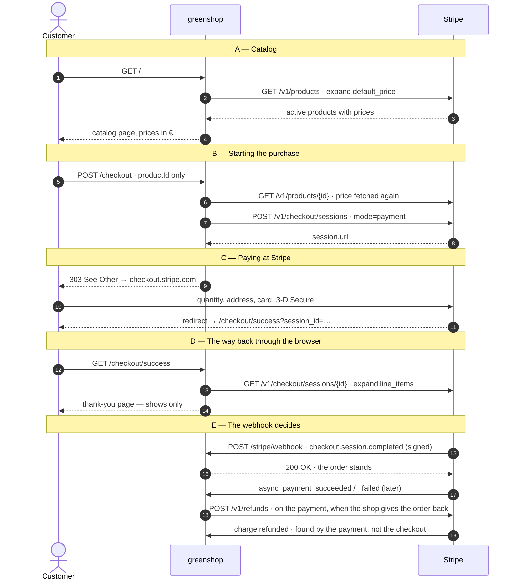

# Who talks to whom, and when

A purchase in greenshop runs over three parties and two separate ways back: one through the
customer's browser, which only shows, and one from Stripe straight to the server, which
decides.

- **The customer's browser** sees the catalog, presses "Kaufen" and types card details — on a
  page of Stripe's, not on ours.
- **greenshop** (Spring Boot, port 8484) knows products, prices and orders only as Stripe
  reports them. It never sees card details.
- **Stripe** is the catalog, the payment page, and the truth about every payment. It reports
  back on its own.

## The flow

## A — Catalog

1. **`GET /`** — the customer opens the start page. greenshop keeps no products of its own.
2. **`GET /v1/products?active=true&expand[]=data.default_price`** — every page view asks Stripe
   again. Without `expand` the answer carries only a price id and every product would need a
   second call.
3. **The answer** holds the active products with their prices. Anything without a fixed amount
   that is paid once is left out, not guessed at.
4. **The catalog page.** 3500 cents become "35,00 €" here, and every row carries a form with a
   single field: the product id.

If Stripe cannot be reached, the page stays and says so, with status 503.

## B — Starting the purchase

5. **`POST /checkout` with `productId` and `attempt`.** The attempt is a UUID drawn when the
   catalog page was built, one per button. No price, no quantity, no amount.
6. **`GET /v1/products/{id}`** — the price is fetched again at the moment of purchase, not
   carried over from the list. Unknown or archived means not for sale, answered with 404.
7. **`POST /v1/checkout/sessions`** — mode `payment`, one line item with the price id, an
   adjustable quantity from 1 to 10, a shipping address for Germany, and the two return
   addresses. The success address carries the placeholder `{CHECKOUT_SESSION_ID}`. The session
   is marked as ours (`metadata.source=greenshop`, `metadata.product`) and carries the attempt
   as `client_reference_id`; the attempt is also the **idempotency key** of this call, so a
   second click opens no second checkout but gets the first one back.

**The amount never comes from the browser.** greenshop sends a price id to Stripe, not a
number. Tampering with the form can at most buy another product — at that product's real price.

## C — Paying at Stripe

8. **The answer** carries the session with its address on `checkout.stripe.com`.
9. **`303 See Other`**, not 302: the browser follows the POST with a GET, and a reload on the
   payment page does not send the form again.
10. **Quantity, address, payment method, card number, 3-D Secure** — all of it between customer
    and Stripe. greenshop sees none of it and therefore does not have to meet the strict rules
    for card data itself.

If the customer breaks off here, Stripe leads them to `/checkout/cancel`. greenshop redirects
into the catalog and says once that nothing was charged. No order comes into being.

## D — The way back through the browser

11. **The redirect** to `/checkout/success?session_id=cs_test_…`; Stripe has replaced the
    placeholder from step 7 with the real session id.
12. **`GET /checkout/success`** — the id comes out of the browser and is nothing to build on.
13. **`GET /v1/checkout/sessions/{id}?expand[]=line_items`** — the line items are not part of a
    session and come only with `expand`. An id Stripe does not know is answered with 404, and
    so is a session without our mark in its metadata: Stripe may know it, but it is not ours.
14. **The thank-you page**: "2 × Schal", the total, and a badge with what Stripe reports right
    now — paid or not paid yet. Nothing is created.

**This page proves nothing.** The customer can close the tab before coming back, and anybody
can call the address with any id.

## E — The webhook decides

15. **`POST /stripe/webhook`** with the header `Stripe-Signature`. Stripe reports
    `checkout.session.completed` whatever the browser does. greenshop checks the signature
    against the webhook secret, over the *raw* body, because that is what it was computed over.
    Without a valid signature: 400, and nothing is read.
16. **`200 OK`.** From the event only the session id is taken; the session is looked up as in
    step 13 and the order is placed: `PAID` when the money is in, otherwise
    `AWAITING_PAYMENT`. Lines and total are copied, not referenced.
17. **`checkout.session.async_payment_succeeded` / `_failed`** — for methods that settle later
    the verdict arrives minutes or days after, and turns the waiting order into a paid or a
    failed one.
18. **`charge.refunded`** — money went back, whether the shop asked for it or somebody pressed
    refund in the Dashboard. The event is about a charge, which names its payment but not the
    checkout, so the order is found by the payment it went through.

## Giving an order back

A paid order is refunded from `/orders`: `POST /orders/{reference}/refund` leads to
`POST /v1/refunds` with the payment intent of that order and no amount, so Stripe gives back
everything. Stripe is asked first and the order is written afterwards — a refund that did not go
through must leave no refunded order behind. A refusal (already refunded, never charged) comes
back as an invalid request, the order stays paid, and the page says so.

**Twice and out of order is normal.** Stripe delivers at least once and promises no order. A
late verdict arriving before its checkout places the order itself, and three things keep a
repeat harmless: the message id of the event, which is written down only once the message is
through; the session id as the order's reference; and a status change that has already happened
and changes nothing. A message about a session that is not marked as this shop's own is
dropped.

## What greenshop answers

| Event or case | What happens | Answer |
|---|---|---|
| `checkout.session.completed` | The order is placed, paid or waiting | 200 |
| `async_payment_succeeded` / `_failed` | A waiting order is settled | 200 |
| any other type of event | Nothing, one line in the log | 200 |
| signature missing or wrong | Nothing, nothing is read | 400 |
| Stripe cannot be reached | Fail on purpose, so it is delivered again | 500 |
| `charge.refunded` | The order behind that payment is marked refunded | 200 |
| the message contradicts the order | Dropped — asking again would not help | 200 |

## Locally the CLI sits in between

Stripe cannot reach `localhost`. While developing, the Stripe CLI stands between step 15 and
greenshop: `stripe listen` collects the events and delivers them to
`localhost:8484/stripe/webhook`. It signs with a `whsec_...` of its own, printed by
`stripe listen --print-secret` — not with the secret of an endpoint from the Dashboard.

That changes the route, not the flow. In production Stripe calls the public address directly
and retries for up to three days. The CLI does not retry; there `stripe events resend evt_...`
sends an event again by hand.
